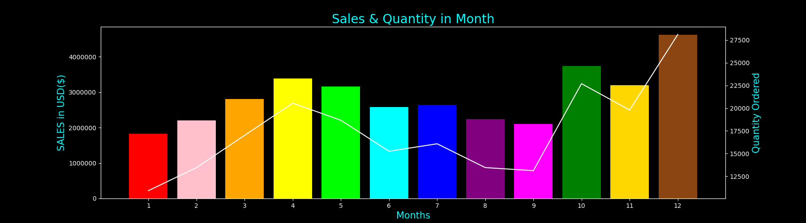
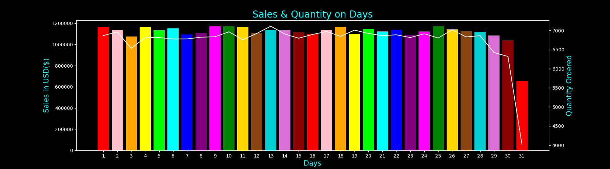
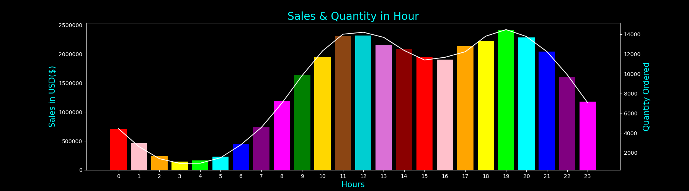
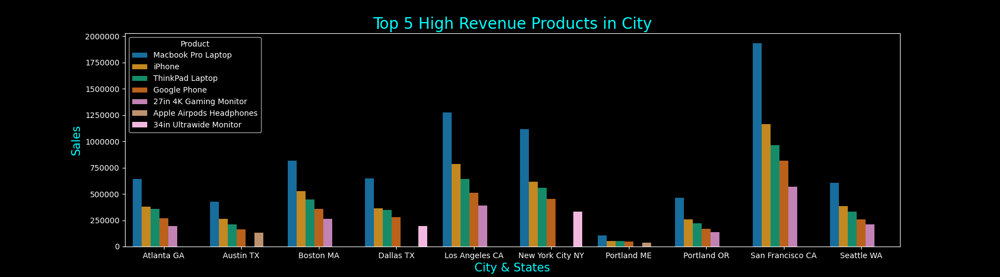
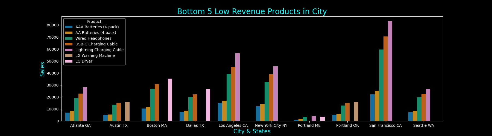
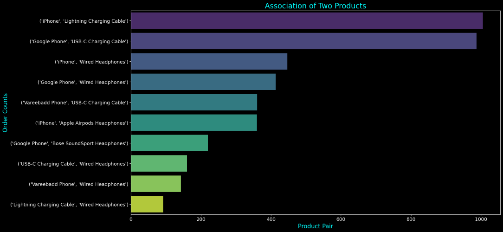
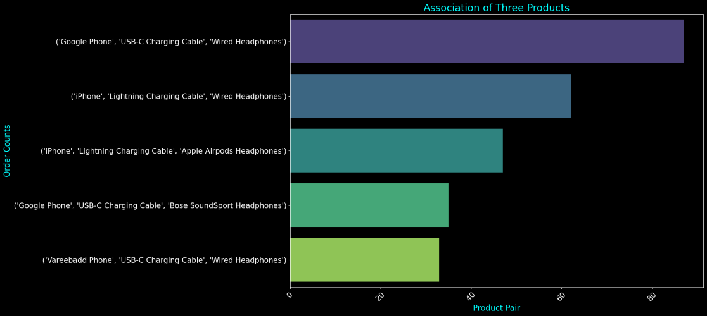

# Amazon-Capstone-Project
This project focuses on solving three key challenges faced by Ecommerce: Customer Lifetime Value (CLV) prediction, supply chain optimization, and recommendation system enhancement. By leveraging data analytics, and optimization techniques, this project aims to improve various aspects of Business operations.

## Problem 1: Customer Lifetime Value (CLV) Prediction
Selecting the right launch date for a sale is crucial for maximizing customer lifetime value (CLV). By considering factors like past customer behavior, peak buying periods, and competitor activities, businesses can strategically plan sales to attract more customers and drive higher profits. Market trends, upcoming events, and holidays should also be considered to leverage customer preferences and enhance engagement. Additionally, segmenting customers and aligning launch dates with their preferences enables targeted promotions and increased sales effectiveness. Remember, while launch dates are important, an overall CLV strategy should also prioritize exceptional customer experiences, loyalty-building efforts, and nurturing long-term customer relationships. 

## Problem 2: Supply Chain Optimization
The goal is to determine the sales of the most and least demanded products on a state-wise basis for supply chain optimization. This information will provide insights into the need for warehousing adjustments in specific regions. By analyzing product sales, we can identify whether to increase or decrease warehousing capacity in a particular state. This optimization strategy enables cost savings by avoiding the construction of redundant warehouses in regions with concurrent demand. By accurately assessing product demand, we can ensure that a single warehouse is sufficient to meet the needs of multiple regions, effectively streamlining the supply chain. 

## Problem 3: Recommendation System Enhancement
Building a recommendation system involves analyzing customer behavior to identify frequently co-purchased products. By collecting transactional data and applying market basket analysis techniques, businesses can generate association rules that represent product relationships. Using the association rules, personalized recommendations can be generated for customers, suggesting items that are likely to be purchased together. 

### Contributors
Sidharth

### Acknowledgements
We would like to express our gratitude to Amazon for providing the necessary resources and support for this capstone project. We also extend our thanks to the open-source community for their valuable contributions to the tools and libraries utilized in this project.

